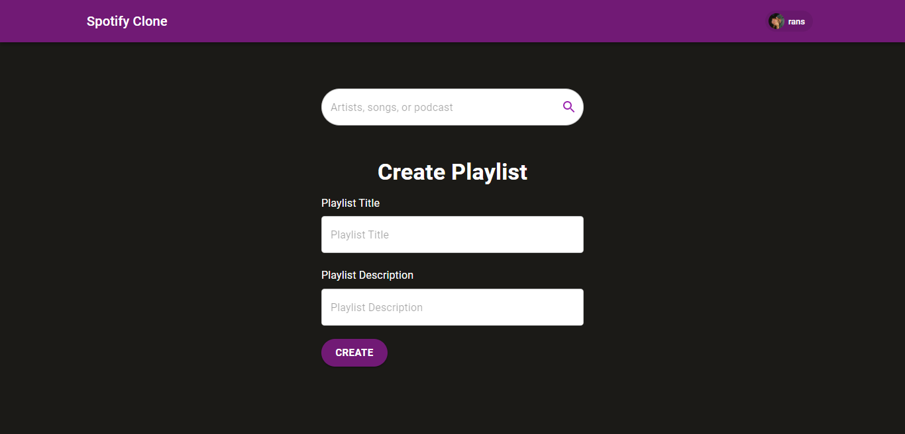
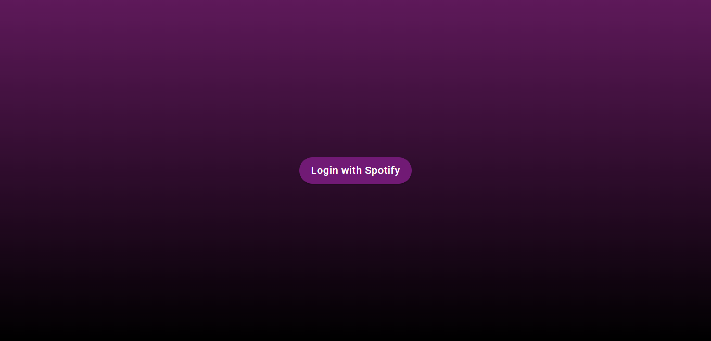
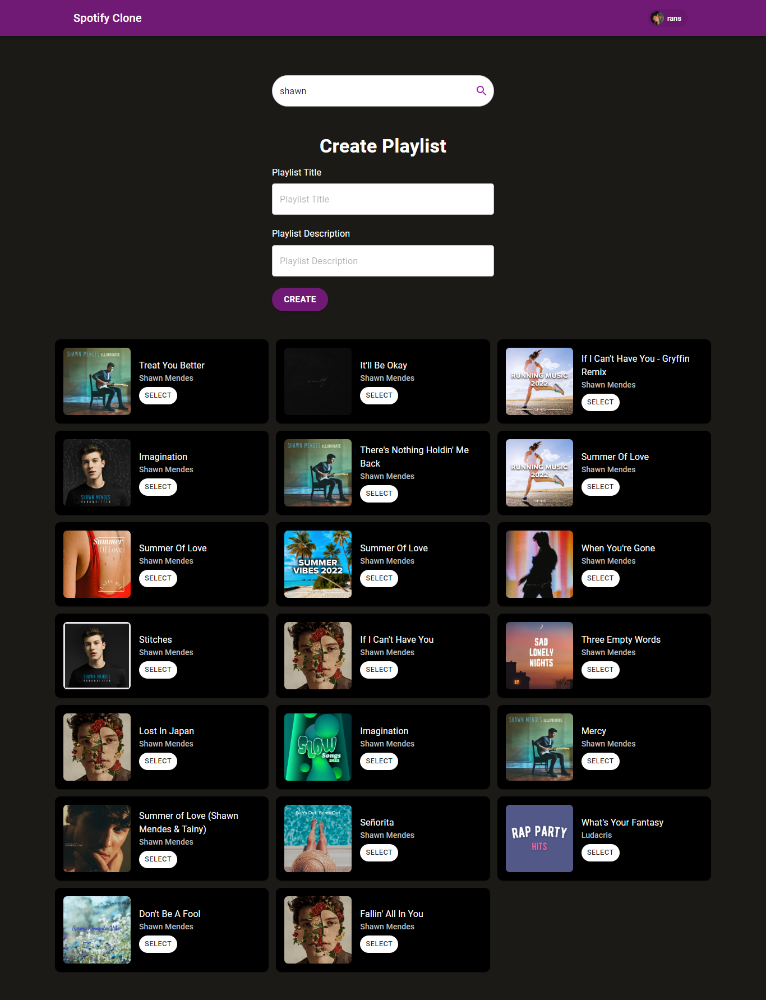

# 🎶 Spotify Clone 🎶
Generasi GIGIH 2.0 Final Project.



Spotify Clone is a web app for creating Spotify playlists. Built with React and Typescript.

## Live Demo
[Click here for demo](https://generasi-gigih-homework-ranuwahyudy.vercel.app)

## Features
- Spotify Authentication
- Single Page Application
- Live Search
- Create a playlist
- Responsive Design

## Tech/Framework Used
- React
- Typescript
- React Redux
- Spotify API
- Material UI

## Installation and Setup Instructions
Clone repo
```
git clone https://github.com/ranuwahyudy/homework-1-week-2.git
```

Install depedencies
```
npm install
```

Create a .env.local file in the root of the project and add your Client ID from the app you just created
```
REACT_APP_SPOTIFY_KEY = <Client ID>
```

Start development environment
```
npm start
```
To build production files and start production server
```
npm run build
```

## Screenshots



